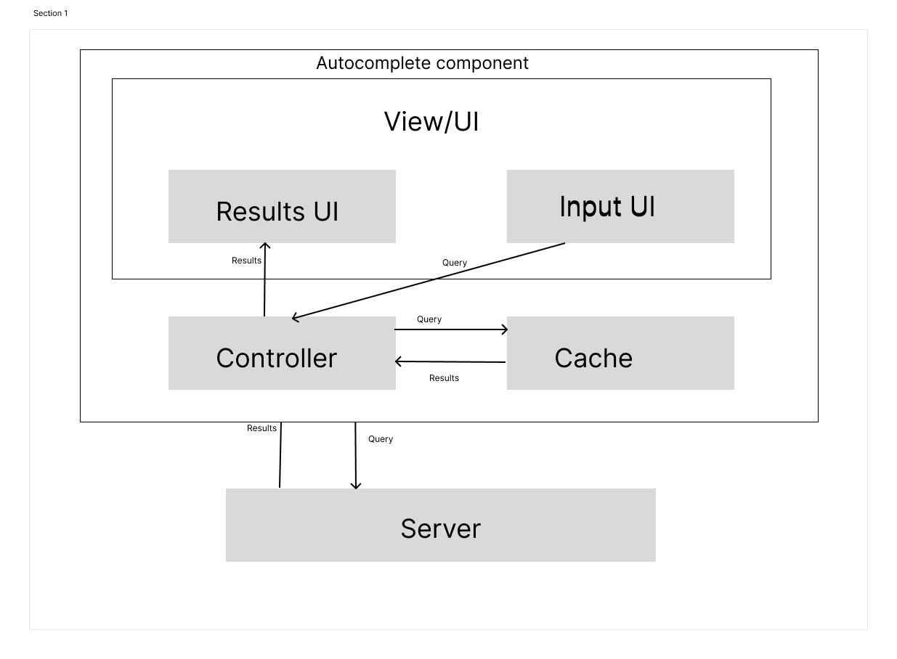

# Autocomplete
## Overview
Autcomplete UI component should allow users to enter a search termin into a text box. A list of results should appear in a popup and a user should be able to select a result.

## Questions to consider
- **What kinds of results should be supported?**
  - Text, image, media
- **What devices should leverage this component?**
  - All devices (mobile, desktop)

## Architecture

### Input field
- Takes user input
- Passes user input to the controller

### Results UI
- Takes results from controller
- Displays content to the user
- Handles selection of result and notifies controller

### Cache
- Stores results of queries

### Controller
- All components interace with this component
- Passes user input and results between components
- Fetches content from cache, if particular query is unavailable then it fetches from the server and stores result in cache